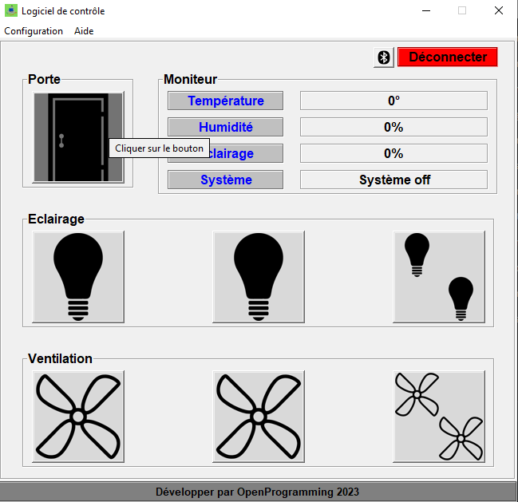
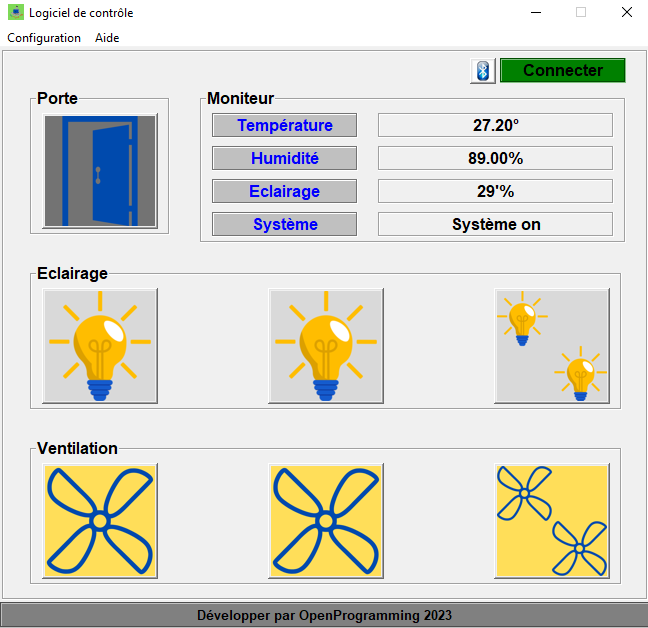

# Projet_GUI_Tkinker : Domotique SmartRoom

*Version d'essais

Ce logiciel est un prototype d'essais développé à des fins d'expérimentation pour communiquer par Bluetooth avec des cartes électronique comme l'arduino et l'esp32...

Aucune garantit de fonctionner correctement est donné.  

Suivez ses vidéos pour plus de détails :
+ https://youtu.be/6f3gPu_oNoQ

Laisser un commentaire des difficultés rencontré ou des suggestions possible afin d'améliorer le code.

* Aperçu du logiciel

